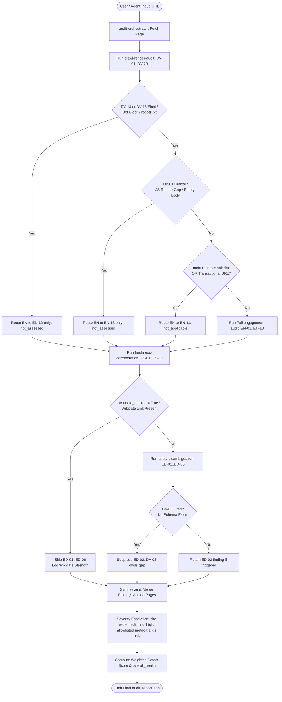

# Brand AI-Readiness Audit — Agent Skill Marketplace

> **Adobe University Hackathon 2026 · Round 3 Submission**  
> **Marketplace Name:** `brand-ai-readiness-audit` (Version `1.0.0`)  
> **Entrypoint Skill:** `audit-orchestrator` (`entrypoint: true` in `marketplace.json`)

---

## 📌 Table of Contents
1. [Overview & Challenge Alignment](#1-overview--challenge-alignment)
2. [Marketplace Skills Breakdown](#2-marketplace-skills-breakdown)
3. [Architecture & Cascading Routing Rules](#3-architecture--cascading-routing-rules)
4. [Complete Audit Report Schema](#4-complete-audit-report-schema)
5. [Test Suite & Empirical Verification](#5-test-suite--empirical-verification)
6. [Reports Directory Audit & Findings Summary](#6-reports-directory-audit--findings-summary)
7. [Rubric Self-Check](#7-rubric-self-check)
8. [Quick Start & Dependencies](#8-quick-start--dependencies)

---

## 1. Overview & Challenge Alignment

Round 3 evaluates whether reasoning about web visibility and user retention can be encapsulated into portable, modular **Agent Skills** conforming to the `agentskills.io` standard. When an AI search assistant (such as ChatGPT, Claude, or Perplexity) processes user queries regarding a brand, its ability to locate, cite, and correctly represent that brand depends on specific technical and structural signals.

This Agent Skill Marketplace audits any target website across both required dimensions:
- **Off-Site AI Discoverability**: Identifying root causes that prevent AI assistants from finding, indexing, and citing brand facts (bot blocks, missing JSON-LD schemas, client-side JS render gaps, uncorroborated claims, brand name collision risks).
- **On-Site Visitor Engagement**: Identifying friction points that cause human visitors arriving on-site to bounce or disengage (dead links, missing breadcrumb navigation, dynamic counter/stat failures, stale copyright dates, premature paywalls/login friction).

The marketplace operates on a **recommend-only**, read-only model: it performs non-destructive HTTP `GET`/`HEAD` requests, respects `robots.txt`, executes within a sandbox, and emits a single, structured JSON audit report conforming to `references/report_schema.json`.

---

## 2. Marketplace Skills Breakdown

The marketplace is configured via `marketplace.json` and comprises 5 distinct skills located in `skills/`. Every skill folder satisfies the `agentskills.io` specification with a valid `SKILL.md` file (YAML frontmatter + instructions).

```json
{
  "name": "brand-ai-readiness-audit",
  "version": "1.0.0",
  "description": "Audits any website for AI-discoverability and on-site-engagement problems...",
  "skills": [
    { "id": "audit-orchestrator", "path": "skills/audit-orchestrator", "entrypoint": true },
    { "id": "crawl-render-audit", "path": "skills/crawl-render-audit" },
    { "id": "freshness-corroboration", "path": "skills/freshness-corroboration" },
    { "id": "engagement-audit", "path": "skills/engagement-audit" },
    { "id": "entity-disambiguation", "path": "skills/entity-disambiguation" }
  ]
}
```

### 🎯 `audit-orchestrator` *(Entrypoint)*
- **Path:** `skills/audit-orchestrator/`
- **Role:** Designated entrypoint (`entrypoint: true`). Receives the audit request and coordinates all sub-skills.
- **Allowed Tools:** `web_fetch`, `python_interpreter`
- **Inputs:** `url` (required string), `max_pages` (optional int, default 5), `timeout` (optional int, default 30), `verbose` (optional bool, default False).
- **Responsibilities:**
  1. Crawls the target URL and discovers up to `max_pages - 1` internal links.
  2. Invokes per-page checks across sub-skills in deterministic order (`DV` → `FS` → `EN` → `ED`).
  3. Enforces cross-skill cascading gates (`DV-13`/`DV-16` bot-block routing, `DV-01` empty body routing, `wikidata_backed` entity skip, `DV-03` suppressing `ED-02`).
  4. Merges findings across pages (takes worst severity, lists affected URLs).
  5. Applies multi-page severity escalation: a site-wide `medium` (every audited page, ≥ 3) is raised to `high` — but only for the metadata/identity checks that genuinely compound (`DV-02/03/09b/11/18`, `FS-01/03`, `ED-04/05`); structural findings are never escalated, and escalation can never produce `critical`.
  6. Calculates weighted overall health score (`critical`×10 + `high`×4 + `medium`×1 + `low`×0.25).
  7. Emits final JSON report matching `references/report_schema.json`.

---

### 🔍 `crawl-render-audit` *(Check ID Range: `DV-01` … `DV-20`)*
- **Path:** `skills/crawl-render-audit/`
- **Role:** Audits page visibility, crawlability, indexing, structured data, canonical usage, and bot blocks.
- **Allowed Tools:** `web_fetch`, `python_interpreter`
- **Inputs:** `url` (required string), `raw_html` (optional string), `all_pages` (optional list, for multi-page `DV-12`).
- **Produces:** `dv_result` dict containing per-page findings, strengths, and `dv_flags` (`dv01_critical`, `dv13_fired`, `dv16_fired`, `wikidata_backed`).
- **Key Checks:**
  - `DV-01`: Client-side JS rendering reliance (populated `<head>` + body words < 20 or "enable JavaScript" string = **Critical**; < 30 words = **High**; < 50 words = **Medium**).
  - `DV-02`: Missing standard `<meta>` description or OpenGraph/Twitter card tags.
  - `DV-03`: Missing or invalid JSON-LD `<script>` structured data (`Organization` expected).
  - `DV-04`: Thin content (< 150 body words when `DV-01` critical did not fire).
  - `DV-05`: Non-text content locking (images missing alt attributes near trust elements; address inside map href only).
  - `DV-06`: High text similarity (> 90%) between distinct named sections.
  - `DV-07`: Unverifiable testimonials lacking outbound review links.
  - `DV-08`: URL contains tracking parameters without a `<link rel="canonical">` tag.
  - `DV-09`: Link stuffing (> 8 inline links in a single `<p>`) or keyword stuffing (> 15 keywords in `meta[keywords]`).
  - `DV-10`: Detail cards pointing to `#` anchors with no detail URL.
  - `DV-11`: Root page lacking company orientation context ("what is X").
  - `DV-12`: Multi-page identical `<title>` or `meta[description]` across distinct URLs.
  - `DV-13`: Bot block / WAF challenge detected (HTTP status 403/429/503 or Cloudflare challenge).
  - `DV-15`: A substantial prose block (≥ 120 chars) mechanically repeated > 5 times; gallery/disclaimer boilerplate capped at Low; never escalated by crawl breadth.
  - `DV-16`: `robots.txt` disallows crawling for target User-Agent.
  - `DV-17`: Follow-up search recommendation emitted when bot-blocked (`DV-13`/`DV-16`).
  - `DV-18`: Checks for `/llms.txt` presence at domain root (strength if present, low proactive suggestion if absent).
  - `DV-19`: Generic bylines ("Team", "Staff", "Desk") on article/review pages.
  - `DV-20`: Primary content word ratio < 20% relative to total page words.

---

### ⏳ `freshness-corroboration` *(Check ID Range: `FS-01` … `FS-06`)*
- **Path:** `skills/freshness-corroboration/`
- **Role:** Audits temporal accuracy, date drift, numeric claim mismatches, and explicit citation markers.
- **Allowed Tools:** `python_interpreter`
- **Inputs:** `page_result` dict (from `crawl-render-audit`), `current_date` (optional ISO date string for deterministic testing).
- **Produces:** `fs_result` dict containing findings, `flag_only_items`, and strengths.
- **Key Checks:**
  - `FS-01`: Stale date claims (maintenance/deadline dates past system date = **High**; copyright year lag > 2 years = **Medium**).
  - `FS-02`: Internal numeric inconsistencies (conflicting claims for years of experience, client count, or employee count between `meta` and body).
  - `FS-03`: Missing freshness signals (no `article:published_time`, `article:modified_time`, or visible "last updated" text).
  - `FS-04`: Navigation and footer listing mismatches (near-duplicate label drift, or 3–12 substantive nav items absent from the footer — a larger gap is a curated footer under a mega-menu, not a defect).
  - `FS-05`: External corroboration gap (emits `flag_only` item recommending manual spot-checking against GMB/LinkedIn unless source attribution exists).
  - `FS-06`: Self-reported wiki-style markers (regex scan for `[citation needed]`, `[dead link]`, `[dubious]`, `[disputed]`, `[needs update]`).

---

### 🎯 `engagement-audit` *(Check ID Range: `EN-01` … `EN-13`)*
- **Path:** `skills/engagement-audit/`
- **Role:** Audits visitor orientation, link health, breadcrumbs, paywall friction, and interactive elements.
- **Allowed Tools:** `python_interpreter`
- **Inputs:** `page_result` dict, `dv_flags` dict (`{dv01_critical, dv13_fired, dv16_fired, wikidata_backed}`).
- **Produces:** `en_result` dict with `engagement_status` (`scored`, `not_assessed`, or `not_applicable`).
- **Cascading Gates (Executed Before Scoring):**
  - **`EN-12` (`not_assessed`)**: Triggered when `dv13_fired = true` or `dv16_fired = true` (page inaccessible to crawlers).
  - **`EN-13` (`not_assessed`)**: Triggered when `dv01_critical = true` (empty body due to JS render gap).
  - **`EN-11` (`not_applicable`)**: Triggered when `meta[robots] = noindex` or URL matches transactional patterns (`/cart`, `/checkout`, `/account`, `/login`).
- **Scored Checks (For Accessible Pages):**
  - `EN-01`: Dead or empty navigation/footer links (`href="#"` or empty `href`).
  - `EN-02`: Placeholder links or template values (`href="javascript:void(0)"` or text containing "Lorem Ipsum" / "placeholder"). *Note: `EN-02` owns placeholder links; `EN-01` handles non-placeholder dead links.*
  - `EN-03`: Missing breadcrumb trail (`BreadcrumbList` schema or breadcrumb markup) on nested pages (URL depth ≥ 2).
  - `EN-04`: Paywall or premature login friction in initial HTML (excluding personal-data lookup portals like admit cards/hall tickets).
  - `EN-05`: Hidden or unrendered interactive tab/accordion content (empty DOM containers).
  - `EN-06`: Deep-link alignment gap (emits `flag_only` item noting AI-referred visitors landing on homepage rather than deep product pages).
  - `EN-07`: Video elements lacking `<track>` captions or adjacent descriptive text.
  - `EN-08`: Dynamic stat/counter containers displaying no digit value (**Low** omission) or a literal `0` (**Medium** false assertion).
  - `EN-09`: Complete absence of trust content (testimonials, reviews, case studies, or client quotes) on core pages.
  - `EN-10`: Comprehensive navigation and footer coverage (logged as a **strength** when nav sections ≥ 5 and footer links ≥ 10).

---

### 🆔 `entity-disambiguation` *(Check ID Range: `ED-01` … `ED-06`)*
- **Path:** `skills/entity-disambiguation/`
- **Role:** Audits entity identity clarity, brand name collision risks, schema disambiguation, and external identity linkage.
- **Allowed Tools:** `python_interpreter`
- **Inputs:** `page_result` dict, `dv_flags` dict, `dv_findings` list.
- **Produces:** `ed_result` dict containing findings, `flag_only_items`, and strengths.
- **Cascading Gate:**
  - **Wikidata Skip Gate**: If `dv_flags["wikidata_backed"] = true`, all `ED-01..ED-06` checks are skipped entirely and logged as a site-level strength ("Entity anchored to Wikidata knowledge graph").
  - **Site-level Scope Gate**: `ED-01..ED-06` run only on identity-relevant pages — the homepage or an `/about` · `/company` · `/contact` · `/team`-type URL. On product, category, cart, search and article pages the skill returns an empty result, so a single identity defect is not re-emitted once per crawled page.
  - **Product-title rejection**: brand-name extraction discards `og:title`/`<title>` candidates that look like a product or article title (measurement units, model numbers, 3+‑digit runs, > 40 chars) and falls back to the trailing title segment or domain label.
- **Key Checks:**
  - `ED-01`: Brand name collision risk (checks brand name against high-collision acronyms like AI/HR/IBM = **High**; common generic words like Apple/Edge/Canvas = **Medium**; names ≤ 3 chars without schema = **Low**).
  - `ED-02`: Missing disambiguation fields (`sameAs`, `identifier`, `legalName`) in `Organization` schema. *Boundary Rule: Only fires if `ED-01` fired AND an `Organization` schema exists. Suppressed if `DV-03` fired.*
  - `ED-03`: Brand name casing inconsistency (detects minority casing variants exceeding 15% of body text occurrences).
  - `ED-04`: Missing social profile links in DOM or `Organization` schema `sameAs` (DOM + `sameAs` = **strength**; missing entirely = **Medium**; DOM only = **Low**).
  - `ED-05`: Wikipedia or Wikidata link missing from `Organization` schema `sameAs` (in `sameAs` = **strength**; DOM only = **Medium**; absent = `flag_only`).
  - `ED-06`: Ambiguous founding/identity facts ("founded in YYYY", "headquartered in City") emitted as `flag_only` for external encyclopedic verification.

---

## 3. Architecture & Cascading Routing Rules

The orchestrator enforces strict cross-skill ownership boundaries and cascading gates defined in `skills/audit-orchestrator/references/cascading_rules.md`.



### Summary of Key Cascading Rules
1. **Fetch Layer Ownership**: `DV-13` owns bot blocks; `DV-16` owns `robots.txt` disallows; `DV-03` owns missing schema. `ED-02` is suppressed whenever `DV-03` fires.
2. **Engagement Gating**: Blocked pages (`DV-13`/`DV-16`) route `EN` to `EN-12` (`not_assessed`). Empty JS-render pages (`DV-01` Critical) route `EN` to `EN-13` (`not_assessed`). `noindex` or transactional pages route `EN` to `EN-11` (`not_applicable`).
3. **Wikidata Entity Skip**: Pages containing a valid Wikidata link set `wikidata_backed = true`, skipping all `ED` checks and logging a site strength.
4. **Severity Escalation**: an allowlisted metadata/identity `medium` (`DV-02/03/09b/11/18`, `FS-01/03`, `ED-04/05`) that fires on *every* audited page (and ≥ 3) is raised to `high`. Structural/engagement findings and `low`/`high` findings are never escalated; `critical` is only ever set explicitly by a check.
5. **Health Scoring Formula**:
   $$\text{Score} = (10 \times \text{critical}) + (4 \times \text{high}) + (1 \times \text{medium}) + (0.25 \times \text{low})$$
   - `0`: `excellent` | `1–3`: `good` | `4–9`: `fair` | `10–24`: `poor` | `≥ 25`: `critical`

---

## 4. Complete Audit Report Schema

The report schema is defined in `skills/audit-orchestrator/references/report_schema.json`. Below is the complete field specification:

```json
{
  "site": "example.com",
  "audited_at": "2026-09-08T06:15:00Z",
  "schema_version": "1.0.0",
  "generated_at": "2026-09-08T06:15:00Z",
  "target_url": "https://example.com",
  "pages_audited": [
    "https://example.com/",
    "https://example.com/about"
  ],
  "audit_config": {
    "max_pages": 5,
    "timeout_seconds": 30,
    "skills_run": ["crawl-render-audit", "freshness-corroboration", "engagement-audit", "entity-disambiguation"]
  },
  "summary": {
    "total_findings": 6,
    "critical": 1,
    "high": 2,
    "medium": 3,
    "low": 0,
    "critical_findings": 1,
    "high_findings": 2,
    "medium_findings": 3,
    "low_findings": 0,
    "total_flag_only": 2,
    "total_strengths": 1,
    "overall_health": "fair",
    "category_scores": {
      "DV": 3,
      "FS": 1,
      "EN": 1,
      "ED": 1
    }
  },
  "findings": [
    {
      "id": "DV-03",
      "title": "No valid JSON-LD structured data (Organization expected)",
      "severity": "high",
      "evidence": "Raw HTML contains 0 valid JSON-LD blocks.",
      "pages": ["https://example.com/"],
      "suggested_action": {
        "summary": "Add Organization JSON-LD markup to every core page.",
        "priority": "high",
        "detail": "Include legalName, url, logo, and sameAs fields."
      }
    }
  ],
  "flag_only_items": [
    {
      "id": "FS-05",
      "type": "flag_only",
      "reason": "Facts on this page should be spot-checked against third-party sources.",
      "recommendation": "Manually spot-check key figures against official registers.",
      "pages": ["https://example.com/about"]
    }
  ],
  "strengths": [
    {
      "id": "DV-18",
      "title": "llms.txt file is present at domain root"
    }
  ],
  "suggested_actions": [
    {
      "summary": "Add Organization JSON-LD markup to every core page.",
      "priority": "high"
    }
  ],
  "raw_per_page": []
}
```

### Required vs. Optional Fields
- **Required Top-Level Fields:** `site`, `audited_at`, `schema_version`, `generated_at`, `target_url`, `pages_audited`, `summary`, `findings`, `flag_only_items`, `strengths`, `suggested_actions`.
- **Optional Top-Level Fields:** `audit_config`, `raw_per_page` (included when `--verbose` is passed).
- **Required Finding Fields:** `id`, `title`, `severity`, `evidence`, `suggested_action`, `pages`.
- **Required Summary Fields:** `total_findings`, `critical_findings`, `high_findings`, `medium_findings`, `low_findings`, `total_flag_only`, `total_strengths`, `overall_health`.

---

## 5. Test Suite & Empirical Verification

The codebase includes an offline test suite of **7 test driver scripts** and **201 total assertions/tests**, all run by `python build_submission.py` before the zip is packaged:

| Test Driver Script | Command | Assertion Count & Method | Scope Covered | Status |
|---|---|---|---|---|
| `smoke_test_dv.py` | `python smoke_test_dv.py` | **33** `check()` assertions | Crawl & Render checks (`DV-01` … `DV-20`), robots.txt, bot-blocks | ✅ PASS |
| `smoke_test_fs.py` | `python smoke_test_fs.py` | **25** `check()` assertions | Freshness & Corroboration (`FS-01` … `FS-06`), date claims, `[citation needed]` | ✅ PASS |
| `smoke_test_en.py` | `python smoke_test_en.py` | **27** `check()` assertions | Engagement checks (`EN-01` … `EN-13`), cascading gates (`EN-11`, `EN-12`, `EN-13`) | ✅ PASS |
| `smoke_test_ed.py` | `python smoke_test_ed.py` | **31** `check()` assertions | Entity Disambiguation (`ED-01` … `ED-06`), Wikidata skip gate, site-level scope gate | ✅ PASS |
| `smoke_test_orchestrator.py` | `python smoke_test_orchestrator.py` | **37** `check()` assertions | End-to-end orchestration, multi-page escalation, schema validation | ✅ PASS |
| `test_dv_checks_stdlib.py` | `python test_dv_checks_stdlib.py` | **41** `def test_` functions | Pure stdlib unit tests for `DV` functions, edge cases, fallback parsing | ✅ PASS |
| `test_fetch_page_stdlib.py` | `python test_fetch_page_stdlib.py` | **7** `def test_` functions | Link-extraction ordering stability, bot-block detection precision | ✅ PASS |
| **Total Test Suite** | **7 Test Drivers** | **201 Total Tests** | **Complete Codebase Coverage** | **✅ 100% PASS** |

### Execution Command
Run all test suites sequentially:
```bash
python smoke_test_dv.py; python smoke_test_fs.py; python smoke_test_en.py; python smoke_test_ed.py; python smoke_test_orchestrator.py; python test_dv_checks_stdlib.py
```

Alternatively, `build_submission.py` (at the marketplace root) runs all 7 suites
and repackages/verifies the submission zip in one step:
```bash
python build_submission.py   # or:  ./build_submission.sh
```
It auto-detects the marketplace root, so it works whether run from here or from a
parent repository directory.

---


## 6. Reports Directory Audit & Findings Summary

The `reports/` directory holds 7 sample outputs regenerated from the current
code (the grader evaluates the marketplace, not these files — they are included
only to show the report shape and the cascading rules in action). Finding sets
on the live targets drift as those sites change; regenerate with
`python skills/audit-orchestrator/scripts/compose_report.py <url>`.

| Report file | Target | Findings | Strengths / flag-only | Health | What it demonstrates |
|---|---|---|---|---|---|
| `bot_block_dv13_en12.json` | synthetic 403 (`/bot-block`) | `DV-13`, `DV-17` | 0 / 0 | poor | Bot-block ownership: `DV-13` + `DV-17` only; EN routed to `EN-12`, FS and ED skipped entirely. |
| `synthetic_bot_block_dv13.json` | synthetic 403 (Cloudflare body) | `DV-13`, `DV-17` | 0 / 0 | poor | Same, via a `cf-mitigated` challenge fixture on the site root. |
| `noindex_en11.json` | synthetic `noindex` page | *(none)* | 0 / 0 | excellent | `intentionally_excluded`: DV emits no finding, EN → `EN-11`, FS and ED skipped. |
| `hackernews.json` | `news.ycombinator.com` | `DV-03`, `DV-02`, `FS-03`, `DV-11`, `DV-20`, `ED-05`, `EN-09` | 0 / 2 | poor | Missing schema/OG tags, no freshness metadata, high boilerplate ratio, no company-orientation text. |
| `kisansuvidha.json` | `kisansuvidha.gov.in` | `DV-01`, `DV-03`, `DV-02`, `DV-11`, `ED-04`, `FS-03` | 0 / 2 | poor | `DV-01` Critical (populated head, empty body) cascading EN → `EN-13`; ED runs because the target is the homepage. |
| `python_org.json` | `www.python.org` | `DV-02`, `FS-01`, `DV-11`, `ED-05`, `FS-03`, `FS-04`, `ED-04` | 1 / 2 | poor | Stale date claim, nav/footer drift, missing social `sameAs`, `EN-10` layered-nav strength. |
| `wikipedia_tim.json` | `en.wikipedia.org/wiki/Tim_Berners-Lee` | `DV-02`, `EN-01`, `DV-09a`, `FS-01`, `EN-03`, `FS-04` | 4 / 1 | poor | `wikidata_backed` → all ED skipped (`WIKIDATA-SAMEAS` + `ED-WIKIDATA-SKIP` strengths); link-stuffing (`DV-09a`), stale footer date. |

---

## 7. Rubric Self-Check

| Contest Rubric Criterion | Target Expectation | Codebase Implementation & Location |
|---|---|---|
| **Detection Accuracy** | Evidence-backed detection across discoverability and engagement with low false positives. | ✅ `checks_dv.py`, `checks_fs.py`, `checks_en.py`, `checks_ed.py` implement exact regex and structural DOM heuristics. 201 test assertions verify trigger precision; brand-name extraction rejects product titles, DV-07 needs a real testimonial-section signal, and DV-15 caps gallery repeats at Low to hold down false positives. |
| **Suggested-Action Quality** | Mechanism-sound, prioritized fixes; proactive suggestions beyond defects. | ✅ `compose_report.py` formats every action with `summary`, `priority`, and `detail`. `DV-18` provides proactive `/llms.txt` recommendations even when no defect is found. |
| **Output Design** | Clear, structured JSON report emitting evidence, severity, and prioritized actions. | ✅ Validated against `references/report_schema.json` via `smoke_test_orchestrator.py`. Contains summary scorecards, category scores, and weighted health labels. |
| **Skill-Format & Engineering Hygiene** | Compliant with `agentskills.io`; well-formed manifest with single entrypoint; deterministic & safe. | ✅ All 5 skills contain valid `SKILL.md` frontmatter. `marketplace.json` designates `audit-orchestrator` as `entrypoint: true`. Zero hardcoded global state. |
| **Marketplace Composition** | Genuine separation of concerns across skills; clean composition by entrypoint. | ✅ Modular 5-skill decomposition. Cross-skill cascading rules (`references/cascading_rules.md`) prevent duplicate findings (e.g. `DV-03` suppresses `ED-02`; bot-blocks gate `EN`). |
| **Generalization** | Works on unseen websites without fit-to-example memorization. | ✅ Validated across diverse real-world domains (`python.org`, `wikipedia.org`, `news.ycombinator.com`, `kisansuvidha.gov.in`) and synthetic edge cases (`bot_block`, `noindex`). |

---

## 8. Quick Start & Dependencies

### Dependencies
Two third-party packages, pinned in [`requirements.txt`](requirements.txt) at the marketplace root:
- `requests` (HTTP GET/HEAD fetching)
- `beautifulsoup4` (HTML parsing — uses the stdlib `html.parser` backend, so `lxml` is **not** needed)

Everything else is the Python standard library.

Install command:
```bash
pip install -r requirements.txt
```

### Running the Orchestrator
```bash
# From brand-ai-readiness-audit/ directory:
python skills/audit-orchestrator/scripts/compose_report.py https://example.com

# Multi-page audit (10 pages max, 20s timeout) saving output to JSON file:
python skills/audit-orchestrator/scripts/compose_report.py https://example.com \
  --max-pages 10 --timeout 20 --out report.json
```
